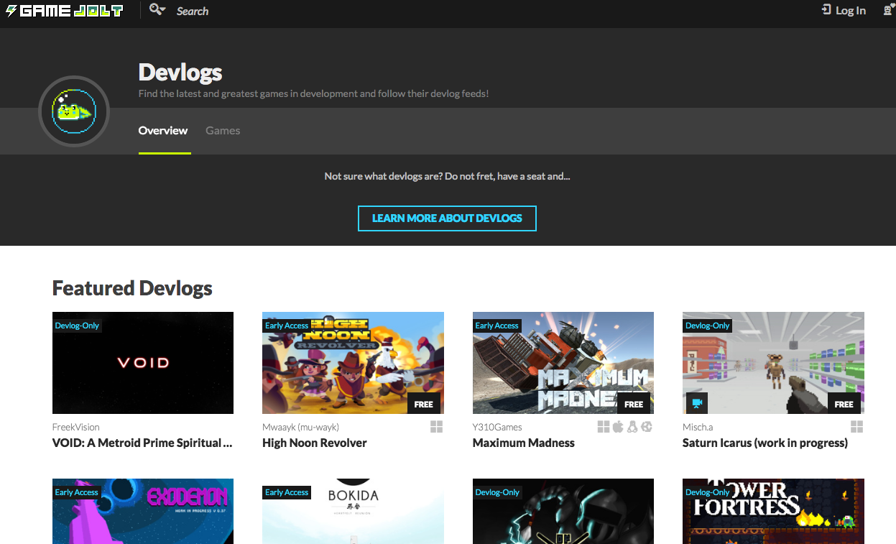
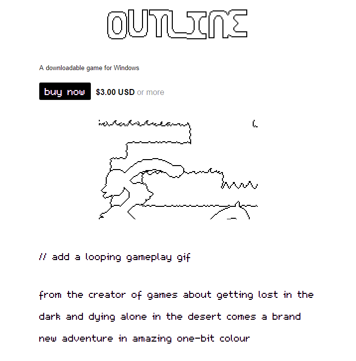
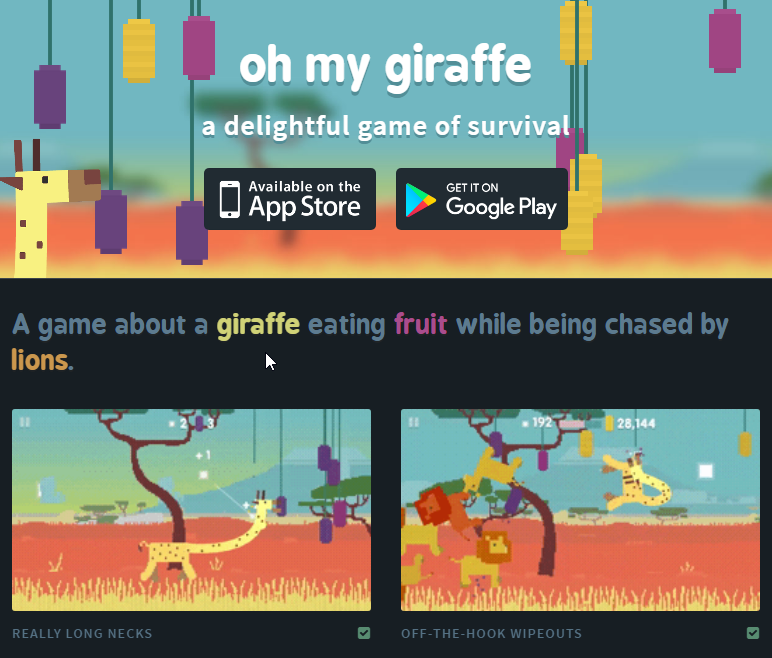

# Criando seu projeto no mundo

No contexto atual, um projeto independente ou de equipes que estão começando precisa conseguir o máximo de divulgação para chamar a atenção da mídia especializada, dos jogadores e de potenciais investidores. Para isso, vamos conversar um pouco sobre diferentes formas de divulgar seu projeto durante seu desenvolvimento.

## Construindo comunidades

Um primeiro ponto a discutir é o fato de que cada vez mais é crucial que jogos não existam apenas como produtos, mas como ganchos, centros, para que comunidades de jogadores e entusiastas se articulem em torno deles. Com tantos projetos de jogos surgindo a cada dia, aqueles que tiverem o potencial e abertura para tentar engajar seu público ganha mais atenção.  

Isso tem uma série de implicações, pois devemos pensar na divulgação de um projeto durante seu desenvolvimento como um processo orgânico que mistura divulgação e propaganda. Ao mesmo tempo que busca construir uma comunidade de futuros jogadores ou fãs, também acaba criando uma imagem do que é o projeto, sua equipe e seus valores. Daí a importância de cuidar da maneira com que fazemos essa divulgação, quanto a tom, conteúdo e plataformas.

Vale a pena pensar em alguns aspectos na hora de definir esse tipo de comunicação:

- Quem é meu público para cada tipo de material? No que esse público se interessa mais: tecnologia, arte, gameplay, vídeos?
- Onde vou focar meus esforços? Qual público faz mais sentido entrar em contato agora?
- Como organizar o trabalho de criação desses conteúdos? Quem será responsável?
- Qual será o calendário de postagens e manutenção? Como é um post padrão em cada plataforma?

## Possibilidades

### Redes sociais e *streaming*

A criação de perfis em diferentes redes sociais pode ajudar a divulgar e criar uma comunidade em torno do seu jogo. Perfis, páginas ou tópicos em redes como Twitter, Facebook e Reddit permitem que pessoas acompanhem notícias de forma orgânica e podem ajudar a que seu conteúdo seja compartilhado e divulgado mais facilmente. No entanto, vale notar que plataformas como o Facebook tem algoritmos que limitam o alcance de postagens que não pagam pelos serviços de divulgação da própria plataforma. Criar perfis e deixá-los desertos não é bom sinal de que o projeto vai bem, logo é importante planejar um calendário mínimo de postagens e manter alguma qualidade e lógica nos posts. Uma boa forma de ter uma referência é ver como jogos semelhantes trabalharam seus perfis.

Uma área que está se tornando cada vez mais chamativa á a de vídeos, tanto um formato de devlog em vídeo, por exemplo, quanto a possibilidade de fazer streamings do desenvolvimento de partes do jogo. Em plataformas como Twitch é possível ver streamings de devs criando partes de jogos, como arte ou programando um sistema, enquanto conversam com fãs. Essa pode ser uma maneira bastante interessante de criar conteúdo sobre seu projeto e construir uma comunidade, mas vale a pena pensar se vocês têm o know-how e recursos para investir nesse tipo de material.

### *Early access* / *alpha*

A vantagem de disponibilizar seu jogo em alguma forma de *early access* ou alpha é ter feedback de jogadores e já ir construindo uma comunidade enquanto o jogo está em desenvolvimento. A dificuldade com esse tipo de abordagem é lidar com expectativas e o custo de manter essa comunidade engajada e saudável, além de manter updates e correções de bug para versões que ainda não serão as finais, o que pode gerar re-trabalho.

No entanto, com plataformas como [Itch](http://itch.io) e [GameJolt](https://gamejolt.com/), fica fácil criar uma página de projeto em desenvolvimento e mantê-la atualizada. O importante é deixar claro que aquele não é produto final ainda e manter uma boa comunicação com os jogadores sobre updates e melhorias.

### Devlog

*Lista de devlogs populares no GameJolt*

Um devlog é basicamente um blog do desenvolvimento de seu jogo. Nele, você pode postar notícias de como o desenvolvimento está avançando, reflexões, novos materiais, gifs, imagens, etc. Pode até convidar pessoas para testes e realizar pequenas promoções ou outras atividades. É uma das formas mais estabelecidas de "colocar seu projeto no mundo". É fácil de direcionar pessoas para lá para terem mais informações, mesmo que sejam um pouco caóticas às vezes (por isso é bom ter algum tipo de post inicial/ "sobre").

Os benefícios básicos de ter um devlog são:

- Ter um lugar para gerar "beats" sobre o jogo, novas notícias
- Ajuda a manter um ritmo de postagem e de desenvolvimento
- Ajuda a construir confiança (em você e no público) e compromisso com o projeto
- Pode chamar a atenção de jogadores, que estão cada vez mais interessados no processo de devlog
- Ajuda a receber feedback cedo no desenvolvimento

Existem plataformas diferentes para criar devlogs. Desde redes sociais ou plataformas de blogging, como Tumblr ou até Instagram, mas também fórums (como o [TIGSource](https://forums.tigsource.com/index.php?board=27.0)) e portais como [GameJolt](http://gamejolt.com/devlogs). Um [devlog no TIGSource](https://forums.tigsource.com/index.php?topic=44137.0) é basicamente um tópico de fórum onde você posta suas notícias e reflexões e outros membros da comunidade podem interagir com você. Já um [devlog no GameJolt](http://gamejolt.com/games/the-adventure-pals-demo/173637) é mais semelhante a um blog mesmo.

### Site do projeto

Essa forma de divulgação de um projeto é quase que auto-explicativa, mas vale a pena apontar para alguns aspectos a serem cuidados e ferramentas que podem ajudar nesse processo.

*Outline, de Daniel Linssen.*

Para a criação de sites de projeto, uma forma interessante é usar plataformas como [Itch](http://itch.io) e [GameJolt](https://gamejolt.com/) para centralizar essas informações. Nessas plataformas você tem bastante liberdade para formatação e organização de seu conteúdo, assim como a possibilidade de incluir comentários e outros recursos, sem ter que cuidar de aspectos como design web avançado ou hospedagem em site próprio. Um bom exemplo é o site do jogo [Outline](https://managore.itch.io/outline), na plataforma Itch. Outras possibilidades são sistemas de blogging como Tumblr, Wordpress ou Medium.

Em um site de projeto/jogo, algumas informações são fundamentais: etapa de desenvolvimento, trailer/screenshots, informações de plataforma e gênero de jogo, assim como contato com os desenvolvedores. Para uma lista mais completa, vale a penar dar uma olhada no formato do [presskit()](http://dopresskit.com/), criado para facilitar o uso de sites de jogos pela imprensa. Um exemplo interessante é o do jogo [Nuclear Throne](http://www.vlambeer.com/press/sheet.php?p=Nuclear_Throne).

*oh my giraffe, por kneeko*

Uma boa forma de pensar sobre **um site é como um hub para todos os outros esforços de divulgação e construção de comunidade, uma porta de entrada para o mundo do seu jogo e a sua comunidade**.
